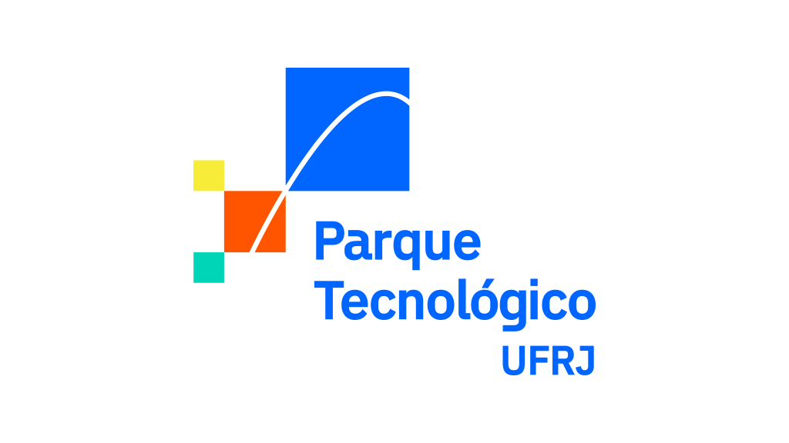
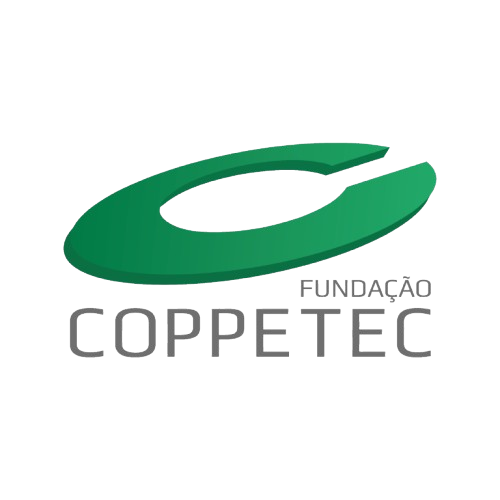

# Contato GUI
[](README.md)

Desktop application for gesture-based MIDI instrument control over Bluetooth Low Energy.

## About

**Contato GUI** is a graphical interface developed for university research by the Partitura Encenada Research Group (GruPPEn), with support from the UFRJ Technological Park. It connects the Contato hardware to any MIDI-compatible synthesizer or DAW. The device uses a gyroscope and a capacitive touch sensor to select and trigger notes in real time.

## Features

- Automatic BLE connection to the Contato device
- **Multiple simultaneous devices**, each in its own tab
- Interactive circular note selector with real-time gyroscope position display
- Support for 1–8 individually configurable note sections
- Instrument selection via MIDI Program Change (16 GM instruments)
- Accelerometer sensitivity setting (Soft / Medium / Strong)
- Configurable gyroscope mapping direction (Left / Right)
- Pitch bend via forearm tilt, with a ±10° dead zone
- Legato mode: the note holds on its own until you trigger another one or hit the percussion
- MIDI output port and channel selection (1–16)
- Save and load setups as JSON files

## Accessibility

- Screen reader support (Narrator and NVDA)
- Full keyboard navigation via Tab and arrow keys
- Automatic app description announcement on startup
- Descriptive accessible names on all controls and tabs
- Sharp notes announced in full (e.g. "Dó Sustenido 3")
- Navigation order: notes first, settings panel after

## Requirements

- Python 3.10 or higher
- Windows 10/11 (BLE support via WinRT) — Linux/macOS work via native Bleak
- Contato hardware with up-to-date firmware

## Installation

```bash
pip install -r requirements.txt
```

## Usage

```bash
python -m src
```

## Build (executable)

Requires [PyInstaller](https://pyinstaller.org):

```bash
pip install pyinstaller
# Windows (semicolon separator)
pyinstaller --noconfirm --windowed --onefile --icon=src/assets/icon.ico --name=Contato --add-data "src/assets;assets" src/__main__.py
# Linux / macOS (colon separator)
pyinstaller --noconfirm --windowed --onefile --icon=src/assets/icon.ico --name=Contato --add-data "src/assets:assets" src/__main__.py
```

Output: `dist/Contato.exe`.

## Project Structure

```
contato_gui/
├── repertorio/              # Ready-to-use setups
├── src/
│   ├── __main__.py              # Entry point and event loop
│   ├── main_window.py           # Main window (QTabWidget)
│   ├── device_tab.py            # Per-device tab (selector, controls, status bar)
│   ├── device_picker_dialog.py  # BLE scan and device selection
│   ├── protocol.py              # BLE UUIDs, packet decoding, MIDI note helpers
│   ├── notes_selector.py        # Circular note selector widget
│   ├── combo_box.py             # Custom ComboBox
│   ├── instrument_dialog.py     # Instrument picker
│   ├── about_dialog.py          # About dialog
│   ├── splash_screen.py         # Loading screen
│   ├── ble_client.py            # BLE connection manager
│   ├── midi_manager.py          # MIDI output
│   ├── constants.py             # BLE UUIDs, enums, musical constants
│   ├── config.py                # Save/load setup
│   └── assets/
│       ├── splash.png       # GruPPEn logo (loading screen)
│       ├── icon.ico
│       └── logos/
│           ├── parque_tecnologico.png
│           ├── ufrj.png
│           ├── inova_ufrj.png
│           └── coppetec.png
```

## Credits

<table>
  <tr>
    <td align="center" colspan="1"><b>Sponsor</b></td>
    <td align="center" colspan="2"><b>Institutional Affiliation</b></td>
    <td align="center" colspan="2"><b>Partners</b></td>
  </tr>
  <tr>
    <td align="center">
      <br/>
      <b>UFRJ Technology Park</b>
    </td>
    <td align="center">
      <br/>
      <b>Federal University<br/>of Rio de Janeiro</b>
    </td>
    <td align="center">
      <b>School of Physical Education<br/>and Sports<br/>Department of Body Arts<br/>NCE – Electronic Computing Nucleus<br/>Center for Arts and Letters</b>
    </td>
    <td align="center">
      <br/>
      <b>Inova UFRJ</b>
    </td>
    <td align="center">
      <br/>
      <b>Fundação Coppetec</b>
    </td>
  </tr>
</table>
