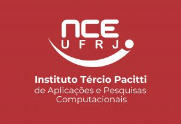

# Contato GUI

Aplicação desktop para controle gestual de instrumentos MIDI via Bluetooth Low Energy.

## Sobre

**Contato GUI** é uma ponte BLE → MIDI que conecta o hardware Contato a qualquer sintetizador ou DAW compatível com MIDI. O dispositivo utiliza giroscópio e sensor capacitivo de toque para selecionar e acionar notas em tempo real, com baixa latência.

## Funcionalidades

- Conexão BLE automática ao dispositivo Contato
- Seletor circular interativo de notas com visualização em tempo real da posição do giroscópio
- Suporte a 1–8 seções de notas configuráveis individualmente
- Seleção de instrumento via Program Change MIDI (16 instrumentos GM)
- Configuração de sensibilidade do acelerômetro (Suave / Médio / Forte)
- Direção do mapeamento do giroscópio configurável (Esquerda / Direita)
- Seleção de porta MIDI de saída e canal (1–16)
- Salvar e carregar configurações em arquivo JSON
- Interface em PyQt6 com tema claro

## Requisitos

- Python 3.10 ou superior
- Windows 10/11 (suporte BLE via WinRT) — Linux/macOS funcionam via Bleak nativo
- Hardware Contato com firmware atualizado

## Instalação

```bash
pip install -r requirements.txt
```

## Uso

```bash
python -m src
```

## Estrutura do Projeto

```
contato_gui/
├── src/
│   ├── __main__.py          # Ponto de entrada
│   ├── app.py               # Inicialização da aplicação
│   ├── main_window.py       # Janela principal
│   ├── notes_selector.py    # Widget seletor circular de notas
│   ├── combo_box.py         # ComboBox customizado
│   ├── ble_client.py        # Gerenciamento da conexão BLE
│   ├── ble_scanner.py       # Descoberta de dispositivos BLE
│   ├── midi_manager.py      # Saída MIDI
│   ├── about_dialog.py      # Diálogo Sobre
│   ├── instrument_dialog.py # Seletor de instrumento
│   ├── splash_screen.py     # Tela de carregamento
│   ├── constants.py         # UUIDs BLE, enums, constantes musicais
│   ├── config.py            # Salvar/carregar configuração
│   └── assets/
│       └── logos/           # Logos dos patrocinadores
│           ├── parque_tec.png
│           ├── nce_ufrj.png
│           └── inova_ufrj.png
└── references/
    └── repertorio/          # Dados de referência de peças musicais
```

## Realização e Apoio

Este projeto é desenvolvido com o apoio de:

<table>
  <tr>
    <td align="center">
      <br/>
      <b>UFRJ Parque Tecnológico</b>
    </td>
    <td align="center">
      <br/>
      <b>Núcleo de Computação Eletrônica<br/>Instituto Tércio Pacitti de Aplicações<br/>e Pesquisas Computacionais (NCE/UFRJ)</b>
    </td>
    <td align="center">
      <br/>
      <b>Inova UFRJ</b>
    </td>
  </tr>
</table>

